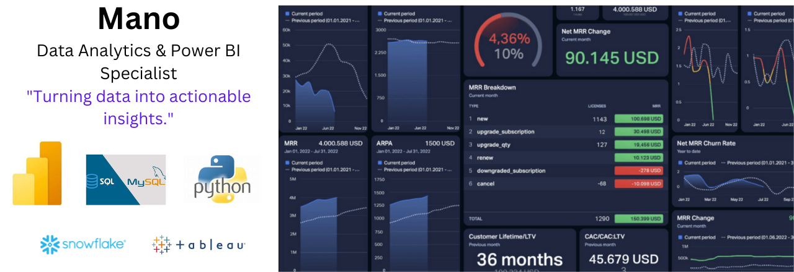

# Hi there! 👋  
I’m Mano, a data storyteller passionate about uncovering insights and driving impactful decisions.  

[🌐 Portfolio]( https://manochitra-loganathan.github.io/Manochitra-The-Analyst.github.io/) | [💼 LinkedIn](https://www.linkedin.com/in/manochitraloganathan/) | [📧 Email Me](manochitra.official@gmail.com)

  

  
  
  
  
  

### Skills  

#### **Programming**  
- Python (Pandas, NumPy, Scikit-learn)  
- R (dplyr, ggplot2)  
- SQL (PostgreSQL, MySQL)  

#### **Data Visualization**  
- Power BI, Tableau  
- Matplotlib, Seaborn, Plotly  

#### **Data Manipulation & Analysis**  
- Excel (Advanced Functions, VBA)  
- ETL Tools (Alteryx, Talend)  
- Data Wrangling (Pandas, R tidyverse)  

#### **Tools and Platforms**  
- Jupyter Notebook, Google Sheets  
- GIS (ArcGIS, QGIS)  
- Snowflake, BigQuery  

#### **Database Management**  
- MongoDB, Microsoft SQL Server , MySQL, PostgreSQL, Oracle, MSSQL, DB2, RDS, Azure SQL

#### **Statistical Analysis & Data Modeling**  
- Regression, Hypothesis Testing, Forecasting  

#### **Cloud Platforms**  
- AWS (Redshift, S3)  
- Google Cloud (BigQuery, Looker)

## 📊 Key Projects  
### [Real Estate Market Analysis](https://github.com/Manochitra-Loganathan/Real-Estate-Market-Analysis)  
- **Objective:** Build a dashboard to analyze real estate trends, including property prices, demand patterns, and market growth.  
- **Tools Used:** Power BI, Python (Pandas, Matplotlib), SQL, Power BI  
- **Results:** Provided actionable insights into market hotspots, price trends, and buyer preferences, improving client decision-making efficiency by 30%.

### [Sports Player Strength Analysis](https://github.com/Manochitra-Loganathan/Sports-Player-Strength-Analysis)  
- **Objective:** Build a dashboard to analyze and visualize sports players' strength metrics, including endurance, speed, agility, and injury history, to assist coaches in improving player performance.  
- **Tools Used:** Power BI, Python (Pandas, Seaborn), SQL, Power BI  
- **Results:** Enabled coaches to identify key performance factors and track player development, enhancing training strategies and improving player selection accuracy by 20%.

  ### [Financial Analysis Dashboard - Product Sales Store Wise](https://github.com/Manochitra-Loganathan/Sports-Player-Strength-Analysis)  
- **Objective:** Build a financial analysis dashboard to track product sales performance across different stores, focusing on revenue, profitability, and sales trends over time.
- **Tools Used:** Power BI, Python (Pandas, Matplotlib), SQL, Power BI  
- **Results:** Provided insights into top-performing stores and products, identifying sales trends and profit margins, leading to a 15% increase in overall sales and better resource allocation across stores.

<!--
**Manochitra-Loganathan/Manochitra-Loganathan** is a ✨ _special_ ✨ repository because its `README.md` (this file) appears on your GitHub profile.

Here are some ideas to get you started:

- 🔭 I’m currently working on ...
- 🌱 I’m currently learning ...
- 👯 I’m looking to collaborate on ...
- 🤔 I’m looking for help with ...
- 💬 Ask me about ...
- 📫 How to reach me: ...
- 😄 Pronouns: ...
- ⚡ Fun fact: ...
-->
